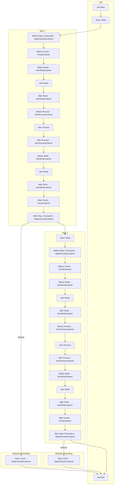

```mermaid
graph TD
    subgraph Job
        A[Job Start] --> B
        AF[Job End]
    end

    subgraph Step 1
        B[Step 1 Start] --> C[Before Step 1 Execution - StepExecutionListener]
        C --> D[Before Chunk - ChunkListener]
        D --> E[Before Read - ItemReadListener]
        E --> F[Item Read]
        F --> G[After Read - ItemReadListener]
        G --> H[Before Process - ItemProcessListener]
        H --> I[Item Process]
        I --> J[After Process - ItemProcessListener]
        J --> K[Before Write - ItemWriteListener]
        K --> L[Item Write]
        L --> M[After Write - ItemWriteListener]
        M --> N[After Chunk - ChunkListener]
        N --> O[After Step 1 Execution - StepExecutionListener]
        
    end

    subgraph Step 2
	    O --> Q
        Q[Step 2 Start] --> R[Before Step 2 Execution - StepExecutionListener]
        R --> S[Before Chunk - ChunkListener]
        S --> T[Before Read - ItemReadListener]
        T --> U[Item Read]
        U --> V[After Read - ItemReadListener]
        V --> W[Before Process - ItemProcessListener]
        W --> X[Item Process]
        X --> Y[After Process - ItemProcessListener]
        Y --> Z[Before Write - ItemWriteListener]
        Z --> AA[Item Write]
        AA --> AB[After Write - ItemWriteListener]
        AB --> AC[After Chunk - ChunkListener]
        AC --> AD[After Step 2 Execution - StepExecutionListener]
        AD --> AF
    end

    subgraph Step1ErrorHandling
        O -->|onError|P[Step 1 Error - StepExecutionListener]
            P -->AF
    end

    subgraph Step2ErrorHandling
        AD -->|onError|AE[Step 2 Error - StepExecutionListener]
        AE -->AF
    end


```

id1(Some text)
id1([Some text])
id1((Some text))
id1{Some text}
id1(Some text)
id1[(Database)]
A-->|text|B

